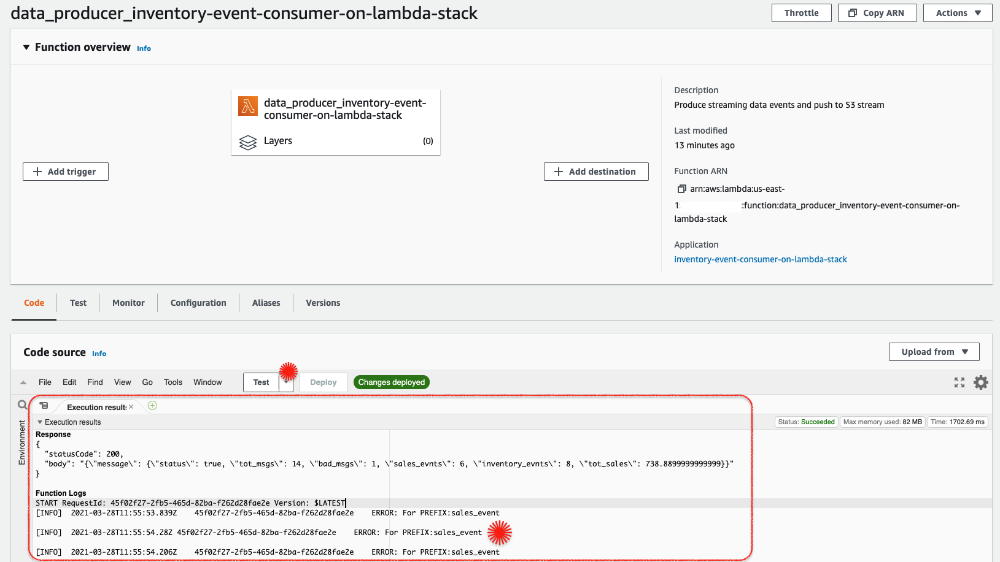
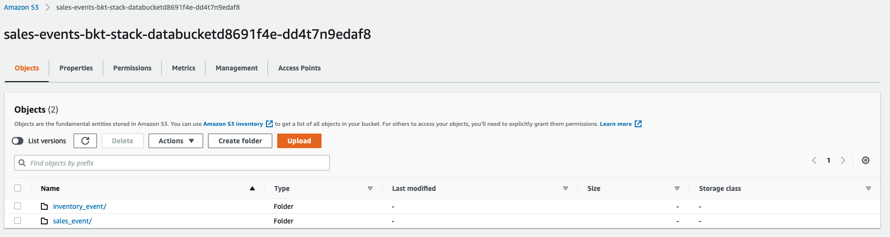

# Shared Data Sets: S3 Security with Access Points

Mystique Unicorn is building a data lake in AWS using S3. Managing access to this shared bucket requires a single bucket policy that controls access for dozens to hundreds of applications with different permission levels. As an application set grows, the bucket policy becomes more complex, time consuming to manage, and needs to be audited to make sure that changes do not have an unexpected impact to an another application.

Can you help them in simplifying the access management of the data sets that can scale with application or user growth?


## 🎯 Solutions

Amazon S3 Access Points<sup>[1]</sup> simplifies managing data access at scale for applications using shared data sets on S3. Access points are unique hostname that customers create to enforce distinct permissions and network controls for any request made through the access point. Customers with shared data sets can easily scale access for hundreds of applications by creating individualized access points with names and permissions customized for each application. Each access point enforces a customized access point policy that works in conjunction with the bucket policy that is attached to the underlying bucket. Adding an S3 access point to a bucket does npt change the bucket's behavior when accessed through the existing bucket name or ARN. All existing operations against the bucket will continue to work as before. Restrictions that you include in an access point policy apply only to requests made through that access point. This way any existing applications can continue to operate as-is and newer applications can be onboard using access points.

Let us consider a scenario, where a store is sending a stream of `sales` and `inventory` events that are to be consumed by two different personas. The sales managers and business analysts will need access to sales data to project revenue and create new marketing campaigns. The warehouse/delivery teams will need access to the inventory data to ensure the orders are dispatched to customer and restocked as needed.


In this demo, we will create a the architecture like the one shown above. Let us say the sales teams will need access to the data from their application running on EC2 and the inventory team will access the data from lambda. We will create a S3 bucket with two access points:
 - `ec2-consumer`: With access only to S3 prefix `sales_event/`
 - And `lambda-consumer`: With access only to S3 prefix `inventory_event/`

1.  ## 🧰 Prerequisites

    This demo, instructions, scripts and cloudformation template is designed to be run in `us-east-1`. With few modifications you can try it out in other regions as well(_Not covered here_).

    - 🛠 AWS CLI Installed & Configured - [Get help here](https://youtu.be/TPyyfmQte0U)
    - 🛠 AWS CDK Installed & Configured - [Get help here](https://www.youtube.com/watch?v=MKwxpszw0Rc)
    - 🛠 Python Packages, _Change the below commands to suit your OS, the following is written for amzn linux 2_
      - Python3 - `yum install -y python3`
      - Python Pip - `yum install -y python-pip`
      - Virtualenv - `pip3 install virtualenv`

1.  ## ⚙️ Setting up the environment

    - Get the application code

      ```bash
      git clone https://github.com/miztiik/secure-s3-with-access-points
      cd secure-s3-with-access-points
      ```

1.  ## 🚀 Prepare the dev environment to run AWS CDK

    We will use `cdk` to make our deployments easier. Lets go ahead and install the necessary components.

    ```bash
    # You should have npm pre-installed
    # If you DONT have cdk installed
    npm install -g aws-cdk

    # Make sure you in root directory
    python3 -m venv .venv
    source .venv/bin/activate
    pip3 install -r requirements.txt
    ```

    The very first time you deploy an AWS CDK app into an environment _(account/region)_, you’ll need to install a `bootstrap stack`, Otherwise just go ahead and deploy using `cdk deploy`.

    ```bash
    cdk bootstrap
    cdk ls
    # Follow on screen prompts
    ```

    You should see an output of the available stacks,

    ```bash
    sales-events-bkt-stack
    secure-s3-with-access-points-vpc-stack
    sales-event-consumer-on-ec2-stack
    inventory-event-consumer-on-lambda-stack
    store-events-bkt-access-points-stack
    ```

1.  ## 🚀 Deploying the application

    Let us walk through each of the stacks,

    - **Stack: sales-events-bkt-stack**

      This stack will create the s3 bucket. We will add a bucket policy to delegate all access management to be done by access points<sup>[2]</sup>.

      Initiate the deployment with the following command,

      ```bash
      cdk deploy sales-events-bkt-stack
      ```

      After successfully deploying the stack, Check the `Outputs` section of the stack. You will find the `StoreEventsBucket`.

    - **Stack: sales-event-consumer-on-ec2-stack**

      To simulate the access of business analysts from EC2, We need simple ec2 instance that we can access. This stack will create the vpc using the stack `secure-s3-with-access-points-vpc-stack`. The EC2 instnace will be launched in the public subnet along with a IAM Role that supports SSM Session Manager access<sup>[3]</sup>. We will later use this IAM Role to give access to the S3 Access Point `ec2-consumer`. _Also note that we will not provide any s3 privileges to our EC2 Instance role, as we are going to manage them using access points._

      Initiate the deployment with the following command,

      ```bash
      cdk deploy secure-s3-with-access-points-vpc-stack
      cdk deploy sales-event-consumer-on-ec2-stack
      ```

      After successfully deploying the stack, Check the `Outputs` section of the stack. You will find the IAM Role Arn `Ec2ConsumerRoleArn` and the instance `Ec2ConsumerInstance`.

    - **Stack: inventory-event-consumer-on-lambda-stack**

      To simulate the access of warehouse application accessing form lambda, we will deploy a simple lambda function that can write to S3 using the access point. The obvious question is that, if we have not yet created the access points, where in S3 will the lambda will write to? Since we know that, we are going to use the `lambda-consumer` as the access point, we will pass that as an environment variable function during deployment. _Also note that we will not provide any s3 privileges to our lambda role, as we are going to manage them using access points._

      ```bash
      cdk deploy inventory-event-consumer-on-lambda-stack
      ```

      After successfully deploying the stack, Check the `Outputs` section of the stack. You will find the IAM Role Arn `LambdaConsumerRoleArn` and the `LambdaConsumer` function. We will invoke this function during our testing phase. If you invoke it now, you will get errors as there no S3 privileges provided.


    - **Stack: store-events-bkt-access-points-stack**

      At this point, we have all created all the prerequisites necessary for setting up our S3 access points. We have our S3 bucket with a policy to delegate access to S3 access points. We have the IAM role arns of our consumer applications. To keep it simple, we will use the following prefix to provide access,
      - **Access Point Name**: `ec2-consumer` with access only to **S3 Prefix**: `sales_event` for role arn: `Ec2ConsumerRoleArn`
      - **Access Point Name**: `lambda-consumer` with access only to **S3 Prefix**: `inventory_event` for role arn: `LambdaConsumerRoleArn`

      ```bash
      cdk deploy store-events-bkt-access-points-stack
      ```

      After successfully deploying the stack, Check the `Outputs` section of the stack. You will find the S3 Access Point Arns `Ec2ConsumerAccessPointArn` and `LambdaConsumerAccessPointArn`. We will be using them during our testing to read/write to the `StoreEventsBucket` bucket.


1.  ## 🔬 Testing the solution

    1. **Access the S3 Console & Check the Access Point and Permissions**:

       
       
    1. **Connect To Ec2 Consumer**:
    
       Connect the `Ec2ConsumerInstance` instance using SSM Session Manager<sup>[3]</sup>. Let us  try to copy some files to our bucket.
       
       **NOTE**: Replace the `Ec2ConsumerAccessPointArn` in the following command with the actual  value from your stack output.
 
       ```bash
       sudo su -
       cd /var/log
       echo '{"secure-s3-with-access-points":"Miztiik Automation"}' > kon.json
       aws s3api put-object --key kon.json --bucket  arn:aws:s3:::sales-events-bkt-stack-databucketd8691f4e-dd4t7n9edaf8 --body kon.json
       ```
        
       The S3 command should give an error message. The reason for that is, our EC2 Instance/IAM  role does not have any privileges to write to the bucket root or any other location. It can  only write to the specified access point and only to the allowed S3 Prefix. Let us try one  more time, writing to the S3 bucket using the AccessPointArn but without the prefix,
 
       **NOTE**: Replace the `Ec2ConsumerAccessPointArn` in the following command with the actual  value from your stack output.
 
       ```bash
       sudo su -
       cd /var/log
       echo '{"secure-s3-with-access-points":"Miztiik Automation"}' > kon.json
       aws s3api put-object --key kon.json --bucket arn:aws:s3:us-east-1:111122223333:accesspoint/ ec2-consumer --body kon.json
       ```
       

       For the final time, let us use the designated prefix `sales_event` for this access point

       ```bash
       sudo su -
       cd /var/log
       echo '{"secure-s3-with-access-points":"Miztiik Automation"}' > kon.json
       aws s3api put-object --key sales_event/kon.json --bucket  arn:aws:s3:us-east-1:111122223333:accesspoint/ec2-consumer --body kon.json
       ```

       

    1. **Invoke Producer Lambda**:
       Let us invoke the lambda `LambdaConsumer` from the AWS Console. This function is designed to try and write to both `sales_event` and `inventory_event` prefix, just to show that it has access privileges only to write to `inventory_event` s3 prefix. Any other attempts will throw an error. If you want to ingest more events, invoke the lambda few times.
       

       You can notice the errors specifically when lambda tries to write to `sales_event` prefix

    1. **Check S3 for Files Logs for Sales Consumer**:

       Here you can notice that the files `kon.json` uploaded from EC2 is under the `sales_event` prefix. Likewise lambda was able to only write to `inventory_prefix`.

       

1.  ## 📒 Conclusion

    Here we have demonstrated how to use manage access to shared buckets using S3 access points. There are few limitations documented here<sup>[4]</sup>. But as time progresses, some of them will be removed or more features will be added to overcome these.

1.  ## 🧹 CleanUp

    If you want to destroy all the resources created by the stack, Execute the below command to delete the stack, or _you can delete the stack from console as well_

    - Resources created during [Deploying The Application](#-deploying-the-application)
    - Delete CloudWatch Lambda LogGroups
    - _Any other custom resources, you have created for this demo_

    ```bash
    # Delete from cdk
    cdk destroy

    # Follow any on-screen prompts

    # Delete the CF Stack, If you used cloudformation to deploy the stack.
    aws cloudformation delete-stack \
      --stack-name "MiztiikAutomationStack" \
      --region "${AWS_REGION}"
    ```

    This is not an exhaustive list, please carry out other necessary steps as maybe applicable to your needs.

## 📌 Who is using this

This repository aims to show how to use S3 Access points to new developers, Solution Architects & Ops Engineers in AWS. Based on that knowledge these Udemy [course #1][102], [course #2][101] helps you build complete architecture in AWS.

### 💡 Help/Suggestions or 🐛 Bugs

Thank you for your interest in contributing to our project. Whether it is a bug report, new feature, correction, or additional documentation or solutions, we greatly value feedback and contributions from our community. [Start here](/issues)

### 👋 Buy me a coffee

[](https://ko-fi.com/Q5Q41QDGK) Buy me a [coffee ☕][900].

### 📚 References

1. [Docs: Amazon S3 - Managing data access with Amazon S3 access points][1]
1. [Docs: Amazon S3 - Delegating access control to access points][2]
1. [AWS SSM Session Manager][3]
1. [Docs: Amazon S3 - Access points restrictions and limitations][4]


### 🏷️ Metadata


**Level**: 200

[1]: https://docs.aws.amazon.com/AmazonS3/latest/userguide/access-points.html
[2]: https://docs.aws.amazon.com/AmazonS3/latest/userguide/access-points-policies.html#access-points-delegating-control
[3]: https://www.youtube.com/watch?v=-ASMtZBrx-k
[4]: https://docs.aws.amazon.com/AmazonS3/latest/userguide/access-points-restrictions-limitations.html

[100]: https://www.udemy.com/course/aws-cloud-security/?referralCode=B7F1B6C78B45ADAF77A9
[101]: https://www.udemy.com/course/aws-cloud-security-proactive-way/?referralCode=71DC542AD4481309A441
[102]: https://www.udemy.com/course/aws-cloud-development-kit-from-beginner-to-professional/?referralCode=E15D7FB64E417C547579
[103]: https://www.udemy.com/course/aws-cloudformation-basics?referralCode=93AD3B1530BC871093D6
[899]: https://www.udemy.com/user/n-kumar/
[900]: https://ko-fi.com/miztiik
[901]: https://ko-fi.com/Q5Q41QDGK